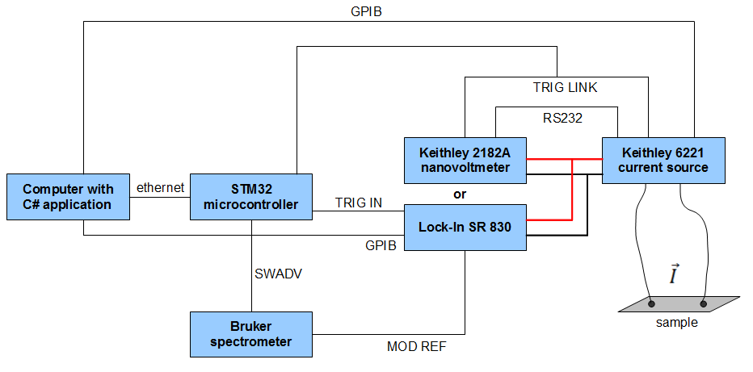

# Electrically Detected Magnetic Resonance
I created Electrically Detected Magnetic Resonance (EDMR) setup during my last year as a student at the Faculty of Physics, University of Warsaw. My master thesis was experimental and concerned topological insulators. All measurements for my thesis I performed in the Electron Spin Resonance ([ESR]) laboratory. The setup described here is an extension of a standard ESR setup. In short, the EDMR technique allows measuring electrical characteristics of a sample exposed to microwave radiation and magnetic field.

ESR spectrometer used in the laboratory is Bruker ELEXSYS E580. While ELEXSYS E580 may be considered as the provider of magnetic field and microwave radiation, Keithley 6221 (current source) and Keithley 2182A (nanovoltmeter) or Stanford Research SR830 (lock-in amplifier) represent suite for electrical measurements. Those devices do not work as one setup out of the box. The main challenge in this project was to force those devices to work together. They were synchronised with the ARM Cortex M3 microprocessor programmed in C. Whole setup is controlled by an application written in C#. Figure 1 presents the scheme of EDMR setup. For more detailed description see [user's manual](https://github.com/MrSzymonello/edmr/blob/master/docs/EDMR_Manual_EN.pdf).

<figure>
    
    <figcaption><i>Figure 1. The scheme of EDMR setup</i></figcaption>
</figure>

[ESR]: http://hyperphysics.phy-astr.gsu.edu/hbase/molecule/esr.html
